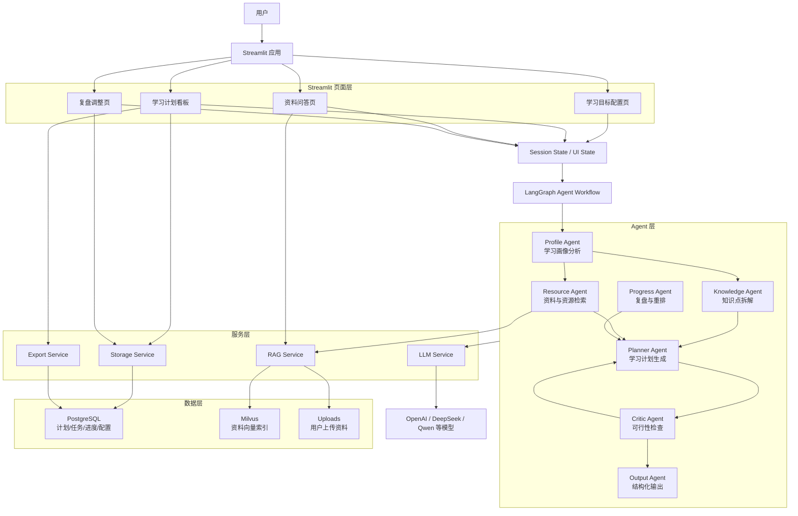

# Study-Planner 智能学习助手 PRD

## 1. 产品概述

Study-Planner 是一个基于成熟 Agent 框架构建的智能学习助手。产品面向有明确学习目标的用户，帮助用户根据目标、截止日期、当前水平、每日可用时间和已有学习资料，自动生成可执行的学习计划，并支持资料问答、学习进度追踪、复盘和动态调整。

本项目参考 `chapter13/helloagents-trip-planner` 的产品模式：用户输入需求，系统通过多 Agent 协作完成信息分析、任务拆解、计划生成、结构化展示、编辑和导出。但 Study-Planner 不再使用 HelloAgents 框架，前端也不再使用 Vue，而是采用 Streamlit 构建 AI 应用界面，采用 LangGraph 作为 Agent 编排框架。

## 2. 产品目标

### 2.1 核心目标

- 帮助用户把模糊学习目标转化为可执行的阶段计划、周计划和日计划。
- 支持用户上传学习资料，并基于资料生成学习路径、摘要、问答和复习任务。
- 根据用户完成情况自动复盘并动态调整后续计划。
- 用 Streamlit 快速实现完整、可交互、可演示的 AI 学习规划工具。

### 2.2 非目标

- MVP 阶段不实现多人账号系统。
- MVP 阶段不实现复杂权限管理。
- MVP 阶段不做移动端独立 App。
- MVP 阶段不依赖 HelloAgents 框架。

## 3. 目标用户

### 3.1 学生

需要为考试、课程学习、论文或项目制订学习计划，希望把大目标拆解成每日任务。

### 3.2 自学者

学习编程、AI、语言、职业技能等，需要根据已有资料和时间安排生成个性化路径。

### 3.3 教师或培训设计者

希望快速生成某个主题的学习路径、周计划、练习安排和复盘建议。

## 4. 用户痛点

- 学习目标大而模糊，不知道从哪里开始。
- 网上资料分散，难以判断学习顺序和重点。
- 计划经常过载，缺少可执行性。
- 学习过程中容易延期，但缺少自动重排机制。
- 看完资料后缺少总结、问答、复习和自测闭环。

## 5. 产品范围

### 5.1 MVP 功能

#### 5.1.1 学习目标输入

用户可以输入或选择：

- 学习主题
- 目标描述
- 截止日期
- 当前水平
- 每日可学习时间
- 每周可学习天数
- 学习偏好，例如阅读、视频、刷题、项目实战
- 薄弱点
- 额外要求

#### 5.1.2 智能学习计划生成

系统根据用户输入生成：

- 总体学习路线
- 阶段目标
- 每周目标
- 每日任务
- 推荐学习方法
- 时间预算
- 风险提示
- 复习安排

#### 5.1.3 计划展示与编辑

用户可以在 Streamlit 页面中查看：

- 今日任务
- 本周任务
- 阶段计划
- 学习进度
- 任务状态

用户可以编辑：

- 任务完成状态
- 任务日期
- 任务时长
- 任务备注

#### 5.1.4 资料上传与问答

用户可以上传：

- PDF
- Markdown
- TXT
- 课程笔记

系统支持：

- 资料摘要
- 概念解释
- 基于资料问答
- 生成复习卡片
- 从资料中提取知识点

#### 5.1.5 复盘与动态调整

用户填写完成情况后，系统生成：

- 本周复盘
- 延期任务处理建议
- 后续计划重排
- 薄弱知识点强化任务
- 下一阶段学习建议

#### 5.1.6 导出

支持导出：

- Markdown 学习计划
- HTML 学习计划
- PDF 学习计划，后续增强

### 5.2 后续增强功能

- 日历视图
- 番茄钟
- 自动提醒
- 学习掌握度雷达图
- 考前冲刺计划
- 错题本
- 多模型选择
- 多用户账号系统
- FastAPI 后端服务化

## 6. 页面设计

### 6.1 首页：学习目标配置

页面组件：

- 学习主题输入框
- 目标描述文本框
- 截止日期选择器
- 当前水平选择器
- 每日学习时间滑块
- 学习偏好多选框
- 薄弱点输入框
- 资料上传入口
- 生成计划按钮

### 6.2 学习计划看板

页面组件：

- 总体目标摘要
- 阶段计划 Tabs
- 今日任务列表
- 本周任务表格
- 任务完成勾选
- 进度图表
- 风险提示区域

### 6.3 资料问答

页面组件：

- 资料上传控件
- 资料列表
- 问答输入框
- 资料摘要按钮
- 复习卡片生成按钮
- 检索来源展示

### 6.4 复盘调整

页面组件：

- 完成情况表格
- 本周复盘输入框
- 自动重排按钮
- 调整后的计划预览
- 保存调整按钮

## 7. 核心用户流程

### 7.1 生成学习计划流程

1. 用户填写学习目标和约束。
2. 用户可选上传学习资料。
3. 系统分析学习画像。
4. 系统拆解知识点和先修关系。
5. 系统检索或整理学习资源。
6. 系统生成结构化学习计划。
7. 系统检查计划是否过载或缺少先修内容。
8. 页面展示计划，用户确认或编辑。

### 7.2 资料问答流程

1. 用户上传资料。
2. 系统解析、切分、向量化并保存资料。
3. 用户输入问题。
4. 系统检索相关资料片段。
5. LLM 基于检索结果回答问题。
6. 页面展示答案和引用来源。

### 7.3 动态调整流程

1. 用户更新任务完成状态。
2. 系统统计完成率、延期任务和薄弱点。
3. Progress Agent 生成复盘。
4. Planner Agent 重排后续学习计划。
5. Critic Agent 检查新计划可行性。
6. 用户确认保存。

## 8. 技术选型

| 模块 | 技术 | 说明 |
|---|---|---|
| 前端应用 | Streamlit | 快速构建 AI 交互界面，支持表单、上传、图表、状态管理 |
| Agent 编排 | LangGraph | 适合多步骤、有状态、可恢复、可人工介入的 Agent 流程 |
| LLM 接入 | LangChain Chat Models | 方便切换 OpenAI、DeepSeek、Qwen 等模型 |
| 数据建模 | Pydantic v2 | 结构化输出校验，降低 LLM 输出不稳定风险 |
| 资料处理 | LangChain Document Loaders | 支持 PDF、Markdown、TXT 等资料解析 |
| 向量数据库 | Milvus | 保存学习资料向量索引，支持后续扩展到大规模资料检索 |
| 关系数据库 | PostgreSQL | 保存计划、任务、进度、用户配置和复盘记录 |
| 图表 | Plotly + Streamlit Charts | 展示进度、时间分布和完成率 |
| 导出 | Markdown / HTML / PDF | 学习计划和复盘报告导出 |

## 9. 系统架构



## 10. Agent 设计

### 10.1 Profile Agent

职责：

- 分析用户当前水平。
- 识别时间约束。
- 识别学习偏好。
- 判断目标难度和风险。

输入：

- StudyGoal

输出：

- LearnerProfile

### 10.2 Knowledge Agent

职责：

- 将学习目标拆解成知识点。
- 标注先修关系。
- 标注难度和重要性。
- 生成知识路径。

输入：

- StudyGoal
- LearnerProfile

输出：

- KnowledgePoint 列表

### 10.3 Resource Agent

职责：

- 处理上传资料。
- 检索相关资料片段。
- 推荐学习资源。
- 为任务绑定资源。

输入：

- 用户上传资料
- KnowledgePoint 列表

输出：

- LearningResource 列表

### 10.4 Planner Agent

职责：

- 生成阶段计划。
- 生成周计划和日计划。
- 分配任务时长。
- 安排复习和练习。

输入：

- LearnerProfile
- KnowledgePoint 列表
- LearningResource 列表

输出：

- StudyPlan

### 10.5 Critic Agent

职责：

- 检查计划是否过载。
- 检查是否遗漏先修知识。
- 检查任务顺序是否合理。
- 给出修改意见。

输入：

- StudyPlan

输出：

- PlanReview

### 10.6 Progress Agent

职责：

- 读取用户完成情况。
- 分析延期任务。
- 总结薄弱点。
- 触发计划重排。

输入：

- StudyPlan
- TaskProgress

输出：

- ReviewReport
- ReplanRequest

## 11. 数据模型草案

### 11.1 StudyGoal

```python
class StudyGoal(BaseModel):
    subject: str
    target: str
    deadline: date
    current_level: str
    daily_available_minutes: int
    weekly_available_days: int
    preferred_methods: list[str]
    weak_points: list[str] = []
    extra_requirements: str = ""
```

### 11.2 KnowledgePoint

```python
class KnowledgePoint(BaseModel):
    name: str
    description: str
    prerequisites: list[str] = []
    difficulty: int
    importance: int
    mastery_level: int = 0
```

### 11.3 StudyTask

```python
class StudyTask(BaseModel):
    title: str
    date: date
    duration_minutes: int
    task_type: str
    related_topics: list[str]
    resource_refs: list[str] = []
    expected_output: str
    status: str = "todo"
    notes: str = ""
```

### 11.4 StudyPlan

```python
class StudyPlan(BaseModel):
    goal: StudyGoal
    phases: list[dict]
    daily_tasks: list[StudyTask]
    weekly_reviews: list[dict]
    risks: list[str]
    suggestions: str
```

## 12. MVP 实施计划

### 12.1 第一阶段：基础框架

- 创建 Streamlit 应用入口。
- 搭建多页面结构。
- 定义 Pydantic 数据模型。
- 接入 LLM 服务。
- 搭建 LangGraph 基础流程。

### 12.2 第二阶段：学习计划生成

- 实现 Profile Agent。
- 实现 Knowledge Agent。
- 实现 Planner Agent。
- 实现 Critic Agent。
- 在页面展示结构化学习计划。

### 12.3 第三阶段：资料上传与 RAG

- 支持 PDF、Markdown、TXT 上传。
- 实现资料解析和切分。
- 建立本地向量索引。
- 实现基于资料的问答。
- 支持资料摘要和复习卡片生成。

### 12.4 第四阶段：进度追踪与重排

- 实现任务状态保存。
- 实现学习进度图表。
- 实现 Progress Agent。
- 支持根据完成情况重排计划。

### 12.5 第五阶段：导出与优化

- 支持 Markdown/HTML 导出。
- 增强 PDF 导出。
- 优化页面交互。
- 增加错误处理和测试。

## 13. 验收标准

### 13.1 功能验收

- 用户可以输入学习目标并生成完整学习计划。
- 生成计划包含阶段、周、日三级结构。
- 每个任务包含日期、时长、类型、知识点和预期产出。
- 用户可以上传资料并进行资料问答。
- 用户可以标记任务完成状态。
- 系统可以根据完成情况生成复盘和调整建议。
- 用户可以导出学习计划。

### 13.2 技术验收

- 不依赖 HelloAgents 框架。
- 前端使用 Streamlit。
- Agent 编排使用 LangGraph。
- LLM 输出通过 Pydantic 校验。
- 本地数据可以持久化保存。
- RAG 检索结果可展示来源。

### 13.3 体验验收

- 首次生成计划流程清晰。
- 页面无需复杂说明即可使用。
- 任务列表易于查看和修改。
- 图表能直观反映学习进度。
- 计划调整结果可被用户确认后保存。

## 14. 风险与应对

| 风险 | 影响 | 应对 |
|---|---|---|
| LLM 输出格式不稳定 | 计划解析失败 | 使用 Pydantic 校验和结构化输出重试 |
| 学习计划过载 | 用户难以执行 | Critic Agent 检查每日任务时长和难度 |
| 上传资料质量低 | RAG 答案不准确 | 展示引用来源，允许用户补充资料 |
| 模型成本过高 | 使用成本上升 | 支持模型切换和缓存 |
| Streamlit 状态复杂 | 页面状态混乱 | 明确 Session State key 和服务层边界 |

## 15. 推荐开发顺序

1. 先实现 Streamlit 单体 MVP。
2. 再实现 LangGraph 多 Agent 编排。
3. 然后加入资料上传和 RAG。
4. 最后加入动态调整、导出和图表。

MVP 阶段推荐架构为：

```text
Streamlit UI
  -> LangGraph Agent Workflow
  -> Pydantic Structured Output
  -> PostgreSQL / Milvus
  -> Dashboard / QA / Export
```
